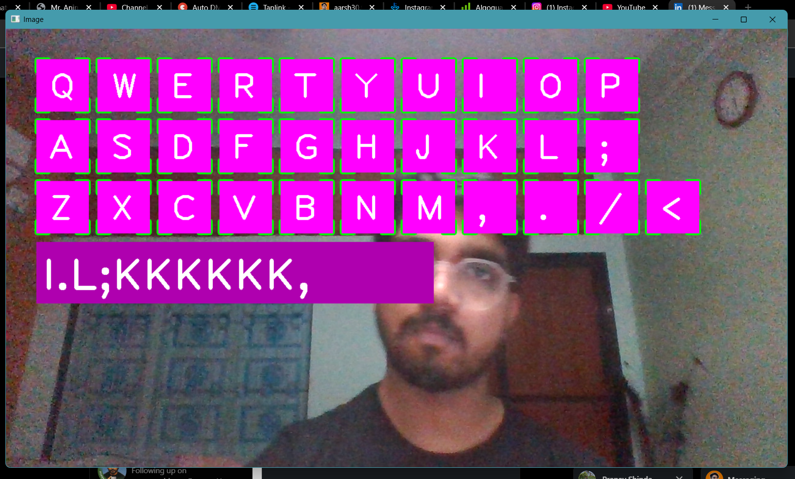

# VisualizationKeyboard

This project implements a virtual keyboard controlled by hand gestures using a webcam. It leverages OpenCV for camera interaction and image processing, `cvzone` for hand tracking, and `pynput` for simulating keyboard presses.

## Features

*   **Virtual Keyboard Display**: A QWERTY-like keyboard layout is rendered on the screen.
*   **Hand Tracking**: Utilizes a webcam to detect and track hand landmarks in real-time.
*   **Gesture-based Typing**: Users can "type" by hovering their index finger over a desired key and then performing a "click" gesture (bringing index and middle fingers together).
*   **Real-time Text Output**: Typed characters are displayed on the screen as they are entered.
*   **System Integration**: Simulated key presses allow the virtual keyboard to interact with other applications on your system.

## Setup

To run this project, you need to have Python installed along with the following libraries:

```bash
pip install opencv-python cvzone pynput numpy
```

## How to Run

1.  **Ensure your webcam is connected and working.**
2.  **Run the Python script:**
    ```bash
    python virtualkeyboard.py
    ```
3.  A window will open displaying your webcam feed with the virtual keyboard overlay.
4.  Position your hand in front of the camera and start typing using the described gestures.
5.  To exit the application, press the 'q' key on your physical keyboard.

## About SWE180

This project is part of SWE180. You can learn more about SWE180 at www.swe180.com, founded by Aarsh Patel.


.jpeg)
